Домашнее задание к занятию Troubleshooting


Цель задания
Устранить неисправности при деплое приложения.

Чеклист готовности к домашнему заданию


Кластер K8s.


Задание. При деплое приложение web-consumer не может подключиться к auth-db. Необходимо это исправить


1) Установить приложение по команде:
kubectl apply -f https://raw.githubusercontent.com/netology-code/kuber-homeworks/main/3.5/files/task.yaml

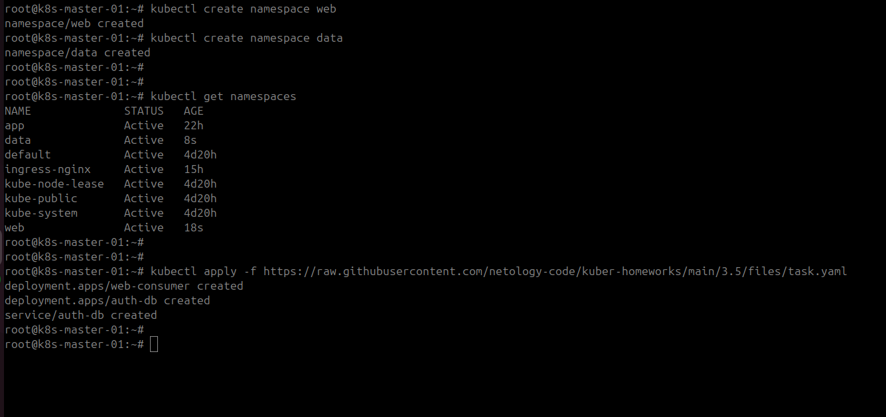


2) Выявить проблему и описать.

Видим поды в неймспейсах не рестартуют, заущены
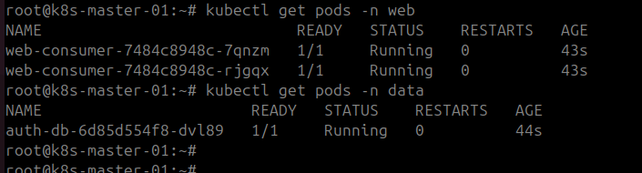

Смотрим логи Веб приложения
```
kubectl logs -n web -l app=web-consumer --tail=5
```

Вижу проблему в резолв имен:
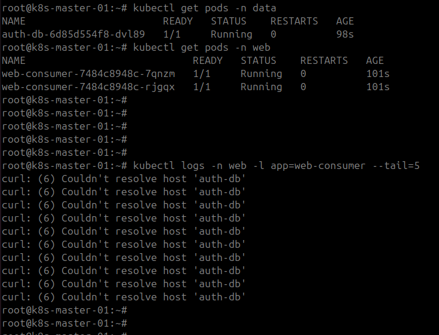

DNS Kubernetes резолвит короткие имена сервисов auth-db только в пределах того же namespace, когда web-consumer пытается обратиться к auth-db, dns ищет сервис auth-db в namespace web — и не находит его.
Для кросс-namespace доступа нужно использовать полное DNS-имя (FQDN):

<service-name>.<namespace>.svc.cluster.local

Ручная проверка из pod:
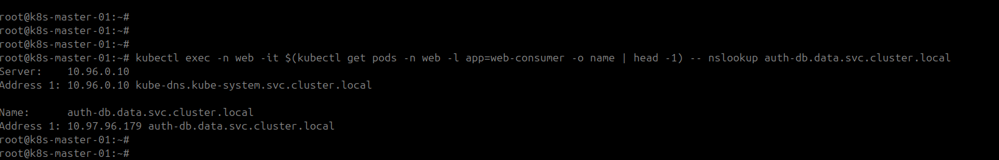

3) Исправить проблему, описать, что сделано.

Создадим манифест:

["Ссылка на fixed-manifest.yaml : "](fixed-manifest.yaml)

Применили:
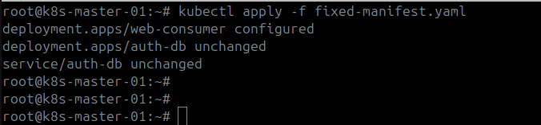

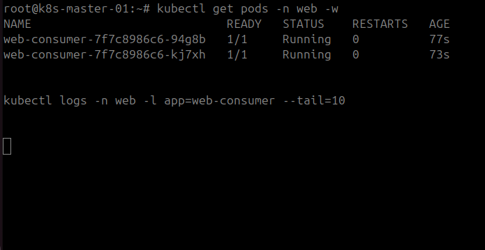

Висим, и по таймаут еще не отвалились, ПОД работает (скорее всего порт не открыт)

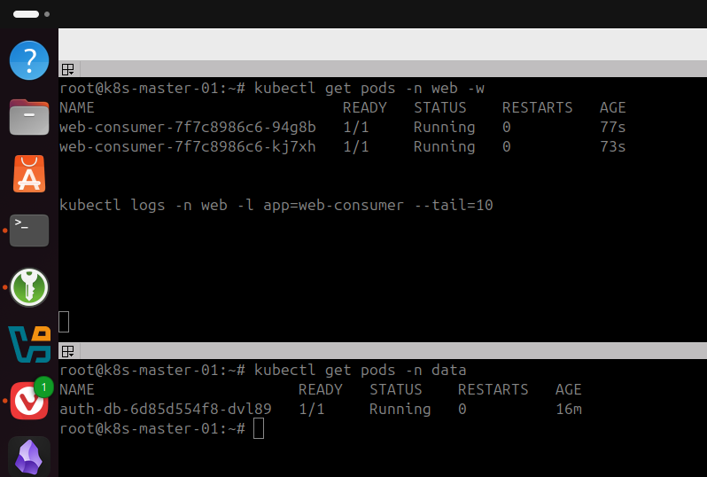

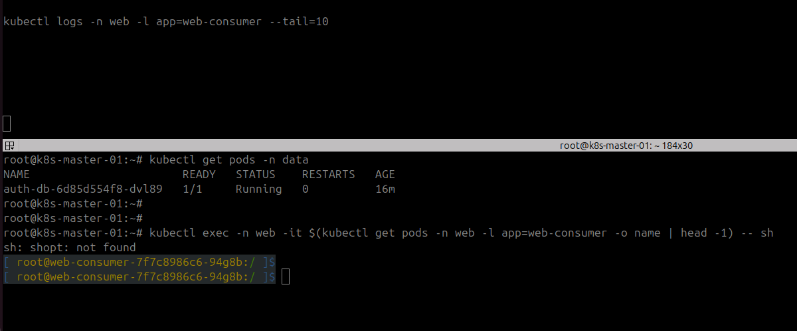

Нет сетевой связанности:

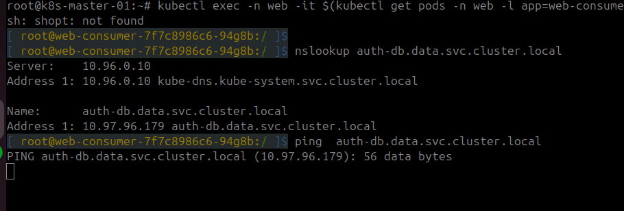

или ICMP трафик не разрешен, проверим curl

```
curl -v --max-time 5 auth-db.data.svc.cluster.local

```
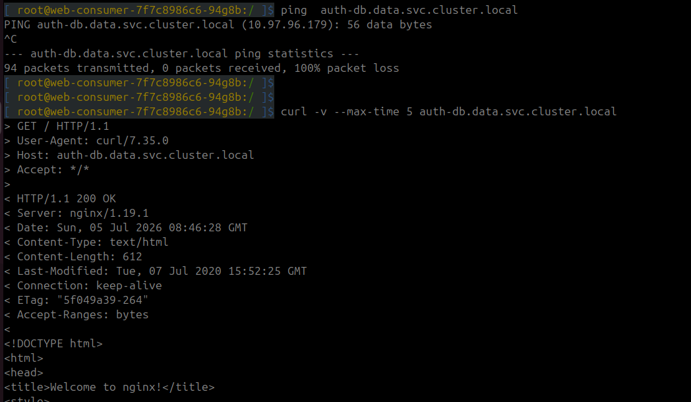

4) Продемонстрировать, что проблема решена.

итого, из логов видно, что podы загрузились полностью, сетевая связанность и резрешение имен по FQDN работает корректно. 

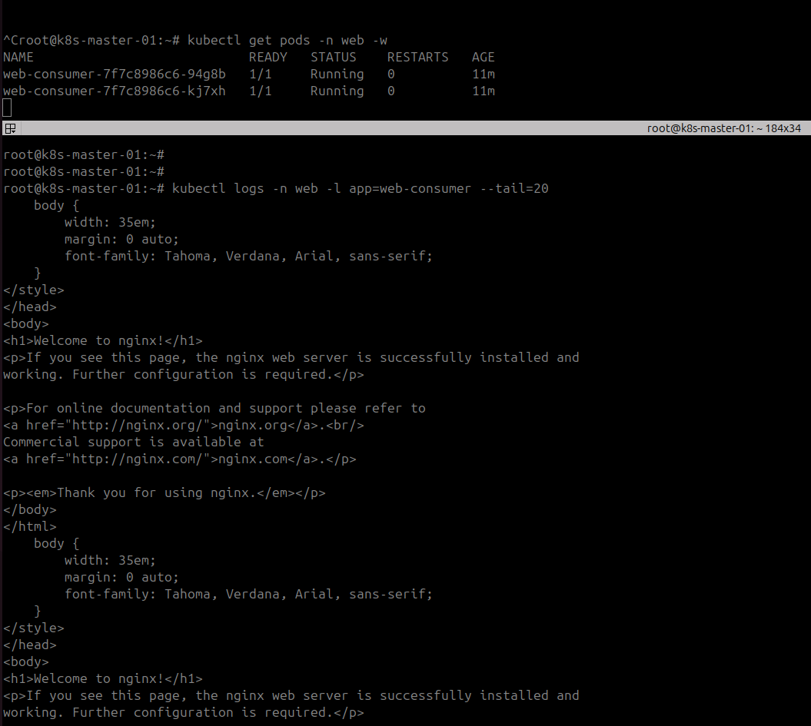

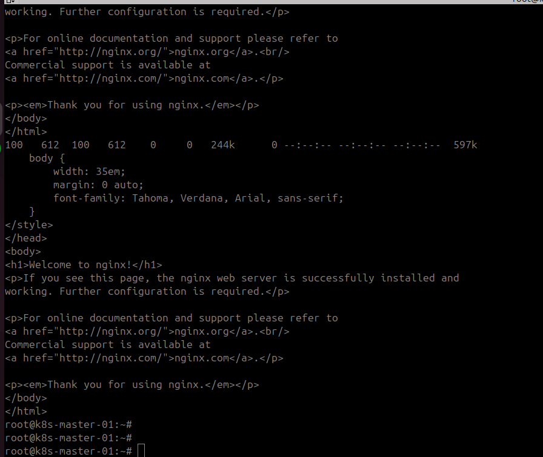


---=== Огромное спасибо за поддержку! Очень рад нашему результату. Вы лучшие наставники! ===---


:-)
С уважением Виктор.


Спасибо Вам за этот результат! Очень ценю Вашу помощь и рад, что учусь у лучших.

